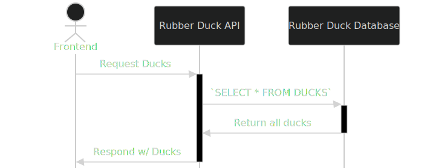

[view me as a page!](https://jarangutan.github.io/oapi-ai-gen-workshop)

---

<!--
footer: ShellHacks 2025
-->

# Building an API in Go using Copilot and Code Gen

 jarangutan

<!-- # Agenda
1. Introduction
2. Overview
3. What are APIs
4. OpenAPI Schemas
5. Getting started with Go
6. Code Generators
7. Lets make an API!
-->

---

<!--
_backgroundImage: url("./assets/chester.png")
_backgroundPosition: right
_backgroundSize: 50%
-->

## whoami

Hi I'm Jose :-)

I like:

- Gardening
- Sourdough
- My dog --->
- Reading documentation
- Concerts

---

## What are the prerequisites?

<!--
_backgroundColor: --bgColor-default
_backgroundImage: url(./assets/gopher.png);
_backgroundPosition: right 10% bottom 0%;
_backgroundSize: 40%;
_backgroundRepeat: no-repeat;
-->

<!--
- Give students a moment to install the tools
- If no time, have students follow. Main has finished code
-->

- Go 1.24+ (<https://go.dev/doc/install>)
- git (<https://git-scm.com/downloads>)
- this repo (<https://qrco.de/shgows>)
- and your favorite IDE

That's it! You can build a lot with just Go

---

## What we're going to do together

- Use OpenAI to build us an OpenAPI spec
- Use Code Generation with our spec to build us an API
- Learn some Go to code up API request handlers
- Build us a database
- Run our API

You'll be coding so get your IDE open!

---

# Did you misspell OpenAI?

No!

OpenAPI (also called swagger) is a formal standard for describing HTTP APIs

---

<!--
_footer: https://swagger.io/docs/specification/v3_0/basic-structure/
-->

## Example

```yaml
openapi: 3.0.4
info:
  title: Sample API
  description: Optional multiline or single-line description in [CommonMark](http://commonmark.org/help/) or HTML.
  version: 0.1.9
servers:
  - url: http://api.example.com/v1
paths:
  /users:
    get:
      summary: Returns a list of users.
      description: Optional extended description in CommonMark or HTML.
      operationId: getUsers
      responses:
        "200": # status code
          description: A JSON array of user names
          content:
            application/json:
              schema:
                type: array
                items:
                  type: string
```

---

## Why make an OpenAPI spec?

- Explains to users what your API does and what it takes/returns
- Unblocks your teammates by having them build clients/mocks off the spec
- Unlocks the use of codegen tools to adhere to the spec
- **Lets you design and iterate over the spec faster than writing code**

---

## Hold on! What even is an API?

<!--
_footer: https://github.com/resources/articles/software-development/what-is-an-api
_class: invert centerimg
-->

<!--
- An API isn't just an HTTP API, an interface for a library can also be an API.
-->

> [Application Programming Interface or APIs] act as bridges between different pieces of software, enabling them to communicate, share data, and work together.



---

# While we're at it, what is Go?

<!--
_footer: https://go.dev/ and https://gobyexample.com/hello-world
-->

<!--
- package main is the package that holds your runnable program
- package main is special in that it cannot be imported and they must contain a main function
- import is importing fmt from the standard library
- func main() is the function that starts your program
-->

Go is a programming language developed by Google that is simple, built for concurrency, and with a strong standard library

```go
package main

import "fmt"

func main() {
    fmt.Println("hello world")
}
```

---

## But I don't know Go :-(

That's OK! While we are coding, I will be referring to entries in

<https://gobyexample.com/>

That way, you get something you can go back to when learning more later

---

<!--
_footer: https://en.wikipedia.org/wiki/Code_generation
-->

# What are Code Generators?

> In computing, code generation denotes software techniques or systems that generate executable code which may then be used independently of the generator system in a runtime environment.

---

<!--
_footer: No need to waste money when you got perfectly awesome tools lying around
-->

## Are we using AI to generate the code?

No :^)

We'll be using [oapi-codegen](https://github.com/oapi-codegen/oapi-codegen) which is a tool that converts OpenAPI specs into idiomatic Go code

---

<!--
_footer: NOTE! If you get stuck or lost, the main branch has the completed project for you to play with!
-->

# Lets get Started :-)

Go to the project repo: [qrco.de/shgows](https://qrco.de/shgows)

```bash
git clone https://github.com/jarangutan/oapi-ai-gen-workshop.git
cd oapi-ai-gen-workshop
git checkout base
go mod tidy
```

---

## Generating Code

```bash
## run all generators in the go module
go generate ./...

## On Linux/Mac, Makefile has a handy shortcut
make gen
```

---

## Running our API

```bash
## On Windows
go run cmd/api/main.go

## On Linux/Mac we can use make like how we use npm run
make run
```

---

## POST a Duck to our API

```bash
curl --request POST \
  --url http://localhost:8080/ducks \
  --header 'Content-Type: application/json' \
  --data '{
  "name": "Jake",
  "color": "red",
  "size": "medium"
}'
```

---

## GET all Ducks from our API

```bash
curl --request GET \
  --url http://localhost:8080/ducks
```

Or

```bash
curl http://localhost:8080/ducks
```

---

## Fancy tools to work with APIs

---

### Editors

- Swagger Editor - <https://editor.swagger.io>
- pb33f "The Doctor" - <https://pb33f.io/doctor>
- Scalar Sandbox - <https://sandbox.scalar.com>

---

### API Client Tools

- Scalar - <https://github.com/scalar/scalar>
- Insomnia - <https://github.com/Kong/insomnia>
- Bruno - <https://github.com/usebruno/bruno>
- Hoppscotch - <https://github.com/hoppscotch/hoppscotch>
- Postman - <https://www.postman.com/>
- and more!

---

<!--
_backgroundImage: url(./assets/gopher_graduate.png);
_backgroundPosition: right 10% bottom 0%;
_backgroundSize: 40%;
_backgroundRepeat: no-repeat;
_class: invert smallpre
-->

# We made it :-D

Awesome job!

If you got stuck or couldn't finish, that's OK!

The main branch has all the working code

```bash
## To go from base to main
## branch and run the API
git add .
git commit -m "phew!"
git checkout main
go run cmd/api/main.go
```

---

# What's next?

Checkout the code in the main repo! There are tons of notes explaining extra bits and pieces of the code

There's also a version of this API that uses sqlite as a database with the same server we just built

---

## But I want more

- [Go's Standard Library](https://github.com/golang/go)
- Read [Go's Blog](https://blog.golang.org/)
  - Specially on slices ([1](https://blog.golang.org/slices-intro), [2](ttps://blog.golang.org/slices)) and [strings](https://blog.golang.org/strings)
- Take [Effective Go](https://go.dev/doc/effective_go)
- [Learn Go with tests](https://quii.gitbook.io/learn-go-with-tests/)
- [Organize a Go module](https://go.dev/doc/modules/layout)
- Read others Go code on Github

---

## Most importantly

Go build!

---

# Q and A

---

# Thank you o/

_Make yourself into a gopher with <https://gopherize.me/>_
